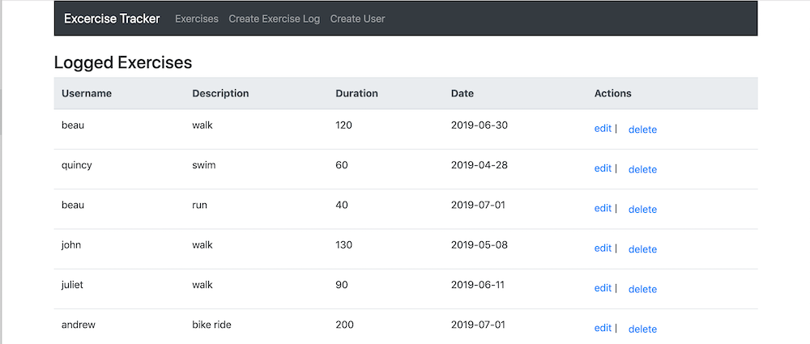

 
# MERN Exercise Tracker Tutorial

## Motivation

- My motivation was to learn MERN stack.
- I followed the Freecodecamp tutorial "Learn the MERN Stack - Full Tutorial (MongoDB, Express, React, Node.js)".

## Screenshots



## Tech/framework used

- [MongoDB Atlas](https://www.mongodb.com/cloud/atlas)
- [Express](https://expressjs.com/)
- [React](https://reactjs.org/)
- [Node.js](https://nodejs.org/en/)
- [Bootstrap](https://getbootstrap.com/)

## Installation and Use

- Download the files, cd into directory and run:
```bash
# Install dependencies
$ npm install

# Run the app
$ npm start
```
## References

- Based on the [Freecodecamp tutorial](https://www.youtube.com/watch?v=7CqJlxBYj-M&t=2416s) by Beau Carnes.

